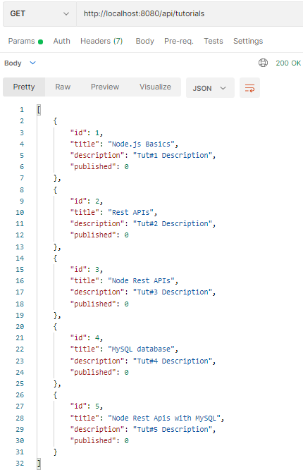
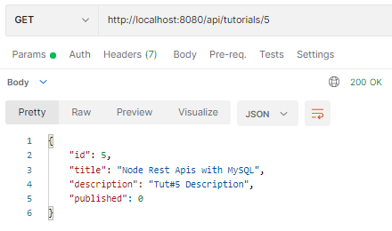
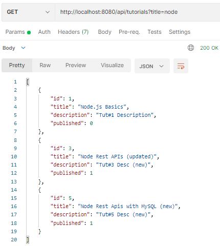
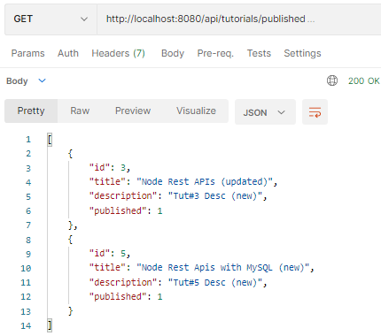
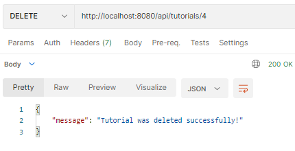
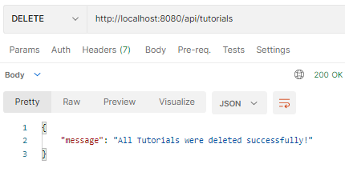

# Node.js Rest APIs with Express & MySQL example

## Project setup
```
npm install
```

### Run
```
node server.js
```


## Tutorial Step-by-step

## Application overview

We will build Rest Apis for creating, retrieving, updating, deleting and searching Tutorials.

First, we start with an Express web server. Next, we add configuration for MySQL database, create `Tutorial` model, write the controller. Then we define routes for handling all CRUD operations:

The following table shows overview of the Rest APIs that will be exported:

| Methods | Urls | Actions |
| --- | --- | --- |
| GET | api/tutorials | get all Tutorials |
| GET | api/tutorials/:id | get Tutorial by `id` |
| POST | api/tutorials | add new Tutorial |
| PUT | api/tutorials/:id | update Tutorial by `id` |
| DELETE | api/tutorials/:id | remove Tutorial by `id` |
| DELETE | api/tutorials | remove all Tutorials |
| GET | api/tutorials/published | find all published Tutorials |
| GET | api/tutorials?title=\[kw\] | find all Tutorials which title contains `'kw'` |

Finally, we’re gonna test the Rest Apis using Postman.


Our project structure will be like:


## Create Node.js application

Open terminal/console, then create a folder for our application:

```
$ mkdir nodejs-express-mysql
$ cd nodejs-express-mysql
```

Initialize the Node.js application with a _package.json_ file:

```
npm init

name: (nodejs-express-mysql) 
version: (1.0.0) 
description: Node.js Restful CRUD API with Node.js, Express and MySQL
entry point: (index.js) server.js
test command: 
git repository: 
keywords: nodejs, express, mysql, restapi
author: 
license: (ISC)

Is this ok? (yes) yes
```

Next, we need to install necessary modules: `express`, `mysql` and `cors`.  
Run the command:

```
npm install express mysql cors --save
```

The _package.json_ file should look like this:

```
{
  "name": "nodejs-express-mysql",
  "version": "1.0.0",
  "description": "Node.js Restful CRUD API with Node.js, Express and MySQL",
  "main": "server.js",
  "scripts": {
    "test": "echo \"Error: no test specified\" && exit 1"
  },
  "keywords": [
    "nodejs",
    "express",
    "mysql",
    "restapi"
  ],
  "author": "",
  "license": "ISC",
  "dependencies": {
    "cors": "^2.8.5",
    "express": "^4.18.1",
    "mysql": "^2.18.1"
  }
}
```

## Setup Express web server

Now, in the root folder, we create a new file named _server.js_:

```
const express = require("express");
const cors = require("cors");

const app = express();

var corsOptions = {
  origin: "http://localhost:8081"
};

app.use(cors(corsOptions));

// parse requests of content-type - application/json
app.use(express.json());

// parse requests of content-type - application/x-www-form-urlencoded
app.use(express.urlencoded({ extended: true }));

// simple route
app.get("/", (req, res) => {
  res.json({ message: "Welcome to my application." });
});

require("./app/routes/tutorial.routes.js")(app);

// set port, listen for requests
const PORT = process.env.PORT || 8080;
app.listen(PORT, () => {
  console.log(`Server is running on port ${PORT}.`);
});
```

– import `express`, and `cors` modules:

-   Express is for building the Rest apis
-   [cors](https://www.npmjs.com/package/cors) provides Express middleware to enable CORS with various options.

– create an Express app, then add body-parser (`json` and `urlencoded`) and `cors` middlewares using `app.use()` method. Notice that we set origin: `http://localhost:8081`.  
– define a GET route which is simple for test.  
– listen on port 8080 for incoming requests.

Now let’s run the app with command: `node server.js`.  
Open your browser with url [http://localhost:8080/](http://localhost:8080/)

## Create MySQL table

Before connecting Node.js Application with MySQL, we need a table first.  
So run the SQL script below to create `tutorials` table:

```
CREATE TABLE IF NOT EXISTS `tutorials` (
  id int(11) NOT NULL PRIMARY KEY AUTO_INCREMENT,
  title varchar(255) NOT NULL,
  description varchar(255),
  published BOOLEAN DEFAULT false
) ENGINE=InnoDB DEFAULT CHARSET=utf8;
```

## Configure & Connect to MySQL database

We’re gonna have a separate folder for configuration. Let’s create _config_ folder in the _app_ folder, under application root folder, then create _db.config.js_ file inside that _config_ folder with content like this:

```
module.exports = {
  HOST: "localhost",
  USER: "root",
  PASSWORD: "123456",
  DB: "testdb"
};
```

Now create a database connection that uses configuration above.  
The file for connection is _db.js_, we put it in _app/models_ folder that will contain model in the next step.

```
const mysql = require("mysql");
const dbConfig = require("../config/db.config.js");

// Create a connection to the database
const connection = mysql.createConnection({
  host: dbConfig.HOST,
  user: dbConfig.USER,
  password: dbConfig.PASSWORD,
  database: dbConfig.DB
});

// open the MySQL connection
connection.connect(error => {
  if (error) throw error;
  console.log("Successfully connected to the database.");
});

module.exports = connection;
```

## Define the Model

In _models_ folder, create a file called _tutorial.model.js_. We’re gonna define constructor for `Tutorial` object here, and use the database connection above to write CRUD functions:

-   create a new Tutorial
-   find a Tutorial by id
-   get all Tutorials
-   get all published Tutorials
-   update a Tutorial by id
-   remove a Tutorial
-   remove all Tutorials

This is the content inside _tutorial.model.js_:

```
const sql = require("./db.js");

// constructor
const Tutorial = function(tutorial) {
  this.title = tutorial.title;
  this.description = tutorial.description;
  this.published = tutorial.published;
};

Tutorial.create = (newTutorial, result) => {
  sql.query("INSERT INTO tutorials SET ?", newTutorial, (err, res) => {
    if (err) {
      console.log("error: ", err);
      result(err, null);
      return;
    }

    console.log("created tutorial: ", { id: res.insertId, ...newTutorial });
    result(null, { id: res.insertId, ...newTutorial });
  });
};

Tutorial.findById = (id, result) => {
  sql.query(`SELECT * FROM tutorials WHERE id = ${id}`, (err, res) => {
    if (err) {
      console.log("error: ", err);
      result(err, null);
      return;
    }

    if (res.length) {
      console.log("found tutorial: ", res[0]);
      result(null, res[0]);
      return;
    }

    // not found Tutorial with the id
    result({ kind: "not_found" }, null);
  });
};

Tutorial.getAll = (title, result) => {
  let query = "SELECT * FROM tutorials";

  if (title) {
    query += ` WHERE title LIKE '%${title}%'`;
  }

  sql.query(query, (err, res) => {
    if (err) {
      console.log("error: ", err);
      result(null, err);
      return;
    }

    console.log("tutorials: ", res);
    result(null, res);
  });
};

Tutorial.getAllPublished = result => {
  sql.query("SELECT * FROM tutorials WHERE published=true", (err, res) => {
    if (err) {
      console.log("error: ", err);
      result(null, err);
      return;
    }

    console.log("tutorials: ", res);
    result(null, res);
  });
};

Tutorial.updateById = (id, tutorial, result) => {
  sql.query(
    "UPDATE tutorials SET title = ?, description = ?, published = ? WHERE id = ?",
    [tutorial.title, tutorial.description, tutorial.published, id],
    (err, res) => {
      if (err) {
        console.log("error: ", err);
        result(null, err);
        return;
      }

      if (res.affectedRows == 0) {
        // not found Tutorial with the id
        result({ kind: "not_found" }, null);
        return;
      }

      console.log("updated tutorial: ", { id: id, ...tutorial });
      result(null, { id: id, ...tutorial });
    }
  );
};

Tutorial.remove = (id, result) => {
  sql.query("DELETE FROM tutorials WHERE id = ?", id, (err, res) => {
    if (err) {
      console.log("error: ", err);
      result(null, err);
      return;
    }

    if (res.affectedRows == 0) {
      // not found Tutorial with the id
      result({ kind: "not_found" }, null);
      return;
    }

    console.log("deleted tutorial with id: ", id);
    result(null, res);
  });
};

Tutorial.removeAll = result => {
  sql.query("DELETE FROM tutorials", (err, res) => {
    if (err) {
      console.log("error: ", err);
      result(null, err);
      return;
    }

    console.log(`deleted ${res.affectedRows} tutorials`);
    result(null, res);
  });
};

module.exports = Tutorial;
```

`Tutorial` model is simple, it contains fields: `title`, `description` & `published`.

We use database connection `query()` method to execute MySQL script: INSERT, SELECT, UPDATE, DELETE. You can find more details about `mysql` module at: [https://www.npmjs.com/package/mysql](https://www.npmjs.com/package/mysql).

## Define Routes

When a client sends request for an endpoint using HTTP request (GET, POST, PUT, DELETE), we need to determine how the server will response. It’s why we’re gonna setup the routes.

These are routes we define:

-   `/tutorials`: GET, POST, DELETE
-   `/tutorials/:id`: GET, PUT, DELETE

Create a _routes_ folder inside _app_ folder, then create _tutorial.routes.js_ file with content like this:

```
module.exports = app => {
  const tutorials = require("../controllers/tutorial.controller.js");

  var router = require("express").Router();

  // Create a new Tutorial
  router.post("/", tutorials.create);

  // Retrieve all Tutorials
  router.get("/", tutorials.findAll);

  // Retrieve all published Tutorials
  router.get("/published", tutorials.findAllPublished);

  // Retrieve a single Tutorial with id
  router.get("/:id", tutorials.findOne);

  // Update a Tutorial with id
  router.put("/:id", tutorials.update);

  // Delete a Tutorial with id
  router.delete("/:id", tutorials.delete);

  // Delete all Tutorials
  router.delete("/", tutorials.deleteAll);

  app.use('/api/tutorials', router);
};
```

You can see that we use a controller from `/controllers/tutorial.controller.js`. It contains methods for handling CRUD operations and will be created in the next step.

We also need to include routes in _server.js_ (right before `app.listen()`):

```
...

require("./app/routes/tutorial.routes.js")(app);

app.listen(...);
```

## Create the Controller

Now we create a _controllers_ folder inside _app_ folder, then we have a file named _tutorial.controller.js_. Our controller will be written inside this with CRUD functions:

-   create
-   findAll
-   findOne
-   findAllPublished
-   update
-   delete
-   deleteAll

```
const Tutorial = require("../models/tutorial.model.js");

// Create and Save a new Tutorial
exports.create = (req, res) => {
  
};

// Retrieve all Tutorials from the database (with condition).
exports.findAll = (req, res) => {
  
};

// Find a single Tutorial with a id
exports.findOne = (req, res) => {
  
};

// find all published Tutorials
exports.findAllPublished = (req, res) => {
  
};

// Update a Tutorial identified by the id in the request
exports.update = (req, res) => {
  
};

// Delete a Tutorial with the specified id in the request
exports.delete = (req, res) => {
  
};

// Delete all Tutorials from the database.
exports.deleteAll = (req, res) => {
  
};
```

Let’s implement these functions.

### Create a new object

Create and Save a new Tutorial:

```
exports.create = (req, res) => {
  // Validate request
  if (!req.body) {
    res.status(400).send({
      message: "Content can not be empty!"
    });
  }

  // Create a Tutorial
  const tutorial = new Tutorial({
    title: req.body.title,
    description: req.body.description,
    published: req.body.published || false
  });

  // Save Tutorial in the database
  Tutorial.create(tutorial, (err, data) => {
    if (err)
      res.status(500).send({
        message:
          err.message || "Some error occurred while creating the Tutorial."
      });
    else res.send(data);
  });
};
```

### Retrieve objects

Retrieve all Tutorials from the database (with or without condition):

```
// Retrieve all Tutorials from the database (with condition).
exports.findAll = (req, res) => {
  const title = req.query.title;

  Tutorial.getAll(title, (err, data) => {
    if (err)
      res.status(500).send({
        message:
          err.message || "Some error occurred while retrieving tutorials."
      });
    else res.send(data);
  });
};

exports.findAllPublished = (req, res) => {
  Tutorial.getAllPublished((err, data) => {
    if (err)
      res.status(500).send({
        message:
          err.message || "Some error occurred while retrieving tutorials."
      });
    else res.send(data);
  });
};
```

### Retrieve a single object

Find a single Tutorial by the `id`:

```
exports.findOne = (req, res) => {
  Tutorial.findById(req.params.id, (err, data) => {
    if (err) {
      if (err.kind === "not_found") {
        res.status(404).send({
          message: `Not found Tutorial with id ${req.params.id}.`
        });
      } else {
        res.status(500).send({
          message: "Error retrieving Tutorial with id " + req.params.id
        });
      }
    } else res.send(data);
  });
};
```

### Update an object

Update a Tutorial identified by the `id` in the request:

```
exports.update = (req, res) => {
  // Validate Request
  if (!req.body) {
    res.status(400).send({
      message: "Content can not be empty!"
    });
  }

  console.log(req.body);

  Tutorial.updateById(
    req.params.id,
    new Tutorial(req.body),
    (err, data) => {
      if (err) {
        if (err.kind === "not_found") {
          res.status(404).send({
            message: `Not found Tutorial with id ${req.params.id}.`
          });
        } else {
          res.status(500).send({
            message: "Error updating Tutorial with id " + req.params.id
          });
        }
      } else res.send(data);
    }
  );
};
```

### Delete an object

Delete a Tutorial with the specified `id` in the request:

```
exports.delete = (req, res) => {
  Tutorial.remove(req.params.id, (err, data) => {
    if (err) {
      if (err.kind === "not_found") {
        res.status(404).send({
          message: `Not found Tutorial with id ${req.params.id}.`
        });
      } else {
        res.status(500).send({
          message: "Could not delete Tutorial with id " + req.params.id
        });
      }
    } else res.send({ message: `Tutorial was deleted successfully!` });
  });
};
```

### Delete all objects

Delete all Tutorials from the database:

```
exports.deleteAll = (req, res) => {
  Tutorial.removeAll((err, data) => {
    if (err)
      res.status(500).send({
        message:
          err.message || "Some error occurred while removing all tutorials."
      });
    else res.send({ message: `All Tutorials were deleted successfully!` });
  });
};
```

## Test the APIs

Run our Node.js application with command: `node server.js`.  
The console shows:

```
Server is running on port 8080.
Successfully connected to the database.
```

Using Postman, we’re gonna test all the Apis above.

**-   Create a new Tutorial using `POST /tutorials` Api**

  


After creating some new Tutorials, we can check MySQL table:

```
mysql> SELECT * FROM tutorials;
+----+---------------------------+-------------------+-----------+
| id | title                     | description       | published |
+----+---------------------------+-------------------+-----------+
|  1 | Node.js Basics            | Tut#1 Description |         0 |
|  2 | Rest APIs                 | Tut#2 Description |         0 |
|  3 | Node Rest APIs            | Tut#3 Description |         0 |
|  4 | MySQL database            | Tut#4 Description |         0 |
|  5 | Node Rest Apis with MySQL | Tut#5 Description |         0 |
+----+---------------------------+-------------------+-----------+
```

**-   Retrieve all Tutorials using `GET /tutorials` Api**

  


**-   Retrieve a single Tutorial by id using `GET /tutorials/:id` Api**

  


**-   Update a Tutorial using `PUT /tutorials/:id` Api**

Check `tutorials` table after some rows are updated:

```
mysql> SELECT * FROM tutorials;
+----+---------------------------------+-------------------+-----------+
| id | title                           | description       | published |
+----+---------------------------------+-------------------+-----------+
|  1 | Node.js Basics                  | Tut#1 Description |         0 |
|  2 | Rest APIs                       | Tut#2 Description |         0 |
|  3 | Node Rest APIs (updated)        | Tut#3 Desc (new)  |         1 |
|  4 | MySQL database                  | Tut#4 Description |         0 |
|  5 | Node Rest Apis with MySQL (new) | Tut#5 Desc (new)  |         1 |
+----+---------------------------------+-------------------+-----------+
```

**-   Find Tutorials by title using `GET /tutorials` Api**

  


**-   Find all published Tutorials**

  


**-   Delete a Tutorial using `DELETE /tutorials/:id` Api**

  


Tutorial with id=4 was removed from `tutorials` table:

```
mysql> SELECT * FROM tutorials;
+----+---------------------------------+-------------------+-----------+
| id | title                           | description       | published |
+----+---------------------------------+-------------------+-----------+
|  1 | Node.js Basics                  | Tut#1 Description |         0 |
|  2 | Rest APIs                       | Tut#2 Description |         0 |
|  3 | Node Rest APIs (updated)        | Tut#3 Desc (new)  |         1 |
|  5 | Node Rest Apis with MySQL (new) | Tut#5 Desc (new)  |         1 |
+----+---------------------------------+-------------------+-----------+
```

**-   Delete all Tutorials using `DELETE /tutorials` Api**

  


Now there are no rows in `tutorials` table:

```
mysql> SELECT * FROM tutorials;
Empty set (0.00 sec)
```

## Conclusion

Today, we’ve learned how to create Node.js Rest Apis with an Express web server. We also know way to add configuration for MySQL database, create a model, write a controller and define routes for handling all CRUD operations and finder methods.

Happy learning! See you again.

## Further Reading

-   [Express.js Routing](http://expressjs.com/en/guide/routing.html)
-   [https://www.npmjs.com/package/express](https://www.npmjs.com/package/express)
-   [https://www.npmjs.com/package/body-parser](https://www.npmjs.com/package/body-parser)
-   [https://www.npmjs.com/package/mysql](https://www.npmjs.com/package/mysql)
