# Node.js Express & MongoDB: CRUD Rest APIs

## Project setup
```
npm install
```

### Run
```
node server.js
```

We will build Rest Apis that can create, retrieve, update, delete and find Tutorials by title.

First, we start with an Express web server. Next, we add configuration for MongoDB database, create `Tutorial` model with Mongoose, write the controller. Then we define routes for handling all CRUD operations (including custom finder).

The following table shows overview of the Rest APIs that will be exported:

| Methods | Urls | Actions |
| --- | --- | --- |
| GET | api/tutorials | get all Tutorials |
| GET | api/tutorials/:id | get Tutorial by `id` |
| POST | api/tutorials | add new Tutorial |
| PUT | api/tutorials/:id | update Tutorial by `id` |
| DELETE | api/tutorials/:id | remove Tutorial by `id` |
| DELETE | api/tutorials | remove all Tutorials |
| GET | api/tutorials/published | find all published Tutorials |
| GET | api/tutorials?title=\[kw\] | find all Tutorials which title contains `'kw'` |

Finally, we’re gonna test the Rest Apis using Postman.

This is our project structure:

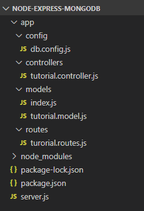

## Create Node.js App

First, we create a folder:

```
$ mkdir nodejs-express-mongodb
$ cd nodejs-express-mongodb
```

Next, we initialize the Node.js App with a _package.json_ file:

```
npm init

name: (nodejs-express-mongodb) 
version: (1.0.0) 
description: Node.js Restful CRUD API with Node.js, Express and MongoDB
entry point: (index.js) server.js
test command: 
git repository: 
keywords: nodejs, express, mongodb, rest, api
author: 
license: (ISC)

Is this ok? (yes) yes
```

We need to install necessary modules: `express`, `mongoose` and `cors`.  
Run the command:

```
npm install express mongoose cors --save
```

The _package.json_ file should look like this:

```
{
  "name": "node-express-mongodb",
  "version": "1.0.0",
  "description": "Node.js Restful CRUD API with Node.js, Express and MongoDB",
  "main": "server.js",
  "scripts": {
    "test": "echo \"Error: no test specified\" && exit 1"
  },
  "keywords": [
    "nodejs",
    "express",
    "rest",
    "api",
    "mongodb"
  ],
  "author": "",
  "license": "ISC",
  "dependencies": {
    "cors": "^2.8.5",
    "express": "^4.18.2",
    "mongoose": "^6.11.1"
  }
}
```

## Setup Express web server

In the root folder, let’s create a new _server.js_ file:

```
const express = require("express");
const cors = require("cors");

const app = express();

var corsOptions = {
  origin: "http://localhost:8081"
};

app.use(cors(corsOptions));

// parse requests of content-type - application/json
app.use(express.json());

// parse requests of content-type - application/x-www-form-urlencoded
app.use(express.urlencoded({ extended: true }));

// simple route
app.get("/", (req, res) => {
  res.json({ message: "Welcome to my application." });
});

// set port, listen for requests
const PORT = process.env.PORT || 8080;
app.listen(PORT, () => {
  console.log(`Server is running on port ${PORT}.`);
});
```

What we do are:  
– import `express` and `cors` modules:

-   Express is for building the Rest apis
-   [cors](https://www.npmjs.com/package/cors) provides Express middleware to enable CORS with various options.

– create an Express app, then add body-parser (`json` and `urlencoded`) and `cors` middlewares using `app.use()` method. Notice that we set origin: `http://localhost:8081`.  
– define a GET route which is simple for test.  
– listen on port 8080 for incoming requests.

Now let’s run the app with command: `node server.js`.  
Open your browser with url [http://localhost:8080/](http://localhost:8080/),

Yeah, the first step is done. We’re gonna work with Mongoose in the next section.

## Configure MongoDB database & Mongoose

In the _app_ folder, we create a separate _config_ folder for configuration with _db.config.js_ file like this:

```
module.exports = {
  url: "mongodb://localhost:27017/your_db"
};
```

## Define Mongoose

We’re gonna define Mongoose model (_tutorial.model.js_) also in **app**/**models** folder in the next step.

Now create **app**/**models**/_index.js_ with the following code:

```
const dbConfig = require("../config/db.config.js");

const mongoose = require("mongoose");
mongoose.Promise = global.Promise;

const db = {};
db.mongoose = mongoose;
db.url = dbConfig.url;
db.tutorials = require("./tutorial.model.js")(mongoose);

module.exports = db;
```

Don’t forget to call `connect()` method in _server.js_:

```
...
const app = express();
app.use(...);

const db = require("./app/models");
db.mongoose
  .connect(db.url, {
    useNewUrlParser: true,
    useUnifiedTopology: true
  })
  .then(() => {
    console.log("Connected to the database!");
  })
  .catch(err => {
    console.log("Cannot connect to the database!", err);
    process.exit();
  });
```

## Define the Mongoose Model

In _models_ folder, create _tutorial.model.js_ file like this:

```
module.exports = mongoose => {
  const Tutorial = mongoose.model(
    "tutorial",
    mongoose.Schema(
      {
        title: String,
        description: String,
        published: Boolean
      },
      { timestamps: true }
    )
  );

  return Tutorial;
};
```

This Mongoose Model represents **tutorials** collection in MongoDB database. These fields will be generated automatically for each Tutorial document: _\_id_, _title_, _description_, _published_, _createdAt_, _updatedAt_, _\_\_v_.

```
{
  "_id": "5e363b135036a835ac1a7da8",
  "title": "Js Tut#",
  "description": "Description for Tut#",
  "published": true,
  "createdAt": "2020-02-02T02:59:31.198Z",
  "updatedAt": "2020-02-02T02:59:31.198Z",
  "__v": 0
}
```

If you use this app with a front-end that needs _id_ field instead of _\_id_, you have to override `toJSON` method that map default object to a custom object. So the Mongoose model could be modified as following code:

```
module.exports = mongoose => {
  var schema = mongoose.Schema(
    {
      title: String,
      description: String,
      published: Boolean
    },
    { timestamps: true }
  );

  schema.method("toJSON", function() {
    const { __v, _id, ...object } = this.toObject();
    object.id = _id;
    return object;
  });

  const Tutorial = mongoose.model("tutorial", schema);
  return Tutorial;
};
```

And the result will look like this-

```
{
  "title": "Js Tut#",
  "description": "Description for Tut#",
  "published": true,
  "createdAt": "2020-02-02T02:59:31.198Z",
  "updatedAt": "2020-02-02T02:59:31.198Z",
  "id": "5e363b135036a835ac1a7da8"
}
```

After finishing the steps above, we don’t need to write CRUD functions, Mongoose Model supports all of them:

-   create a new Tutorial: object.[save()](https://mongoosejs.com/docs/api/model.html#model_Model-save)
-   find a Tutorial by id: [findById](https://mongoosejs.com/docs/api/model.html#model_Model.findById)(id)
-   retrieve all Tutorials: [find()](https://mongoosejs.com/docs/api/model.html#model_Model.find)
-   update a Tutorial by id: [findByIdAndUpdate](https://mongoosejs.com/docs/api/model.html#model_Model.findByIdAndUpdate)(id, data)
-   remove a Tutorial: [findByIdAndRemove](https://mongoosejs.com/docs/api/model.html#model_Model.findByIdAndRemove)(id)
-   remove all Tutorials: [deleteMany()](https://mongoosejs.com/docs/api/model.html#model_Model.deleteMany)
-   find all Tutorials by title: find({ title: { $regex: new RegExp(title), $options: “i” } })

These functions will be used in our Controller.

## Create the Controller

Inside **app**/**controllers** folder, let’s create _tutorial.controller.js_ with these CRUD functions:

-   create
-   findAll
-   findOne
-   update
-   delete
-   deleteAll
-   findAllPublished

```
const db = require("../models");
const Tutorial = db.tutorials;

// Create and Save a new Tutorial
exports.create = (req, res) => {
  
};

// Retrieve all Tutorials from the database.
exports.findAll = (req, res) => {
  
};

// Find a single Tutorial with an id
exports.findOne = (req, res) => {
  
};

// Update a Tutorial by the id in the request
exports.update = (req, res) => {
  
};

// Delete a Tutorial with the specified id in the request
exports.delete = (req, res) => {
  
};

// Delete all Tutorials from the database.
exports.deleteAll = (req, res) => {
  
};

// Find all published Tutorials
exports.findAllPublished = (req, res) => {
  
};
```

Let’s implement these functions.

### Create a new object

Create and Save a new Tutorial:

```
exports.create = (req, res) => {
  // Validate request
  if (!req.body.title) {
    res.status(400).send({ message: "Content can not be empty!" });
    return;
  }

  // Create a Tutorial
  const tutorial = new Tutorial({
    title: req.body.title,
    description: req.body.description,
    published: req.body.published ? req.body.published : false
  });

  // Save Tutorial in the database
  tutorial
    .save(tutorial)
    .then(data => {
      res.send(data);
    })
    .catch(err => {
      res.status(500).send({
        message:
          err.message || "Some error occurred while creating the Tutorial."
      });
    });
};
```

### Retrieve objects (with condition)

Retrieve all Tutorials/ find by title from the database:

```
exports.findAll = (req, res) => {
  const title = req.query.title;
  var condition = title ? { title: { $regex: new RegExp(title), $options: "i" } } : {};

  Tutorial.find(condition)
    .then(data => {
      res.send(data);
    })
    .catch(err => {
      res.status(500).send({
        message:
          err.message || "Some error occurred while retrieving tutorials."
      });
    });
};
```

We use `req.query.title` to get query string from the Request and consider it as condition for `findAll()` method.

### Retrieve a single object

Find a single Tutorial with an `id`:

```
exports.findOne = (req, res) => {
  const id = req.params.id;

  Tutorial.findById(id)
    .then(data => {
      if (!data)
        res.status(404).send({ message: "Not found Tutorial with id " + id });
      else res.send(data);
    })
    .catch(err => {
      res
        .status(500)
        .send({ message: "Error retrieving Tutorial with id=" + id });
    });
};
```

### Update an object

Update a Tutorial identified by the `id` in the request:

```
exports.update = (req, res) => {
  if (!req.body) {
    return res.status(400).send({
      message: "Data to update can not be empty!"
    });
  }

  const id = req.params.id;

  Tutorial.findByIdAndUpdate(id, req.body, { useFindAndModify: false })
    .then(data => {
      if (!data) {
        res.status(404).send({
          message: `Cannot update Tutorial with id=${id}. Maybe Tutorial was not found!`
        });
      } else res.send({ message: "Tutorial was updated successfully." });
    })
    .catch(err => {
      res.status(500).send({
        message: "Error updating Tutorial with id=" + id
      });
    });
};
```

### Delete an object

Delete a Tutorial with the specified `id`:

```
exports.delete = (req, res) => {
  const id = req.params.id;

  Tutorial.findByIdAndRemove(id)
    .then(data => {
      if (!data) {
        res.status(404).send({
          message: `Cannot delete Tutorial with id=${id}. Maybe Tutorial was not found!`
        });
      } else {
        res.send({
          message: "Tutorial was deleted successfully!"
        });
      }
    })
    .catch(err => {
      res.status(500).send({
        message: "Could not delete Tutorial with id=" + id
      });
    });
};
```

### Delete all objects

Delete all Tutorials from the database:

```
exports.deleteAll = (req, res) => {
  Tutorial.deleteMany({})
    .then(data => {
      res.send({
        message: `${data.deletedCount} Tutorials were deleted successfully!`
      });
    })
    .catch(err => {
      res.status(500).send({
        message:
          err.message || "Some error occurred while removing all tutorials."
      });
    });
};
```

### Find all objects by condition

Find all Tutorials with `published = true`:

```
exports.findAllPublished = (req, res) => {
  Tutorial.find({ published: true })
    .then(data => {
      res.send(data);
    })
    .catch(err => {
      res.status(500).send({
        message:
          err.message || "Some error occurred while retrieving tutorials."
      });
    });
};
```

This controller can be modified a little to return pagination response:

```
{
    "totalItems": 8,
    "tutorials": [...],
    "totalPages": 3,
    "currentPage": 1
}
```


## Define Routes

When a client sends request for an endpoint using HTTP request (GET, POST, PUT, DELETE), we need to determine how the server will reponse by setting up the routes.

These are our routes:

-   `/api/tutorials`: GET, POST, DELETE
-   `/api/tutorials/:id`: GET, PUT, DELETE
-   `/api/tutorials/published`: GET

Create a _tutorial.routes.js_ inside _app/routes_ folder with content like this:

```
module.exports = app => {
  const tutorials = require("../controllers/tutorial.controller.js");

  var router = require("express").Router();

  // Create a new Tutorial
  router.post("/", tutorials.create);

  // Retrieve all Tutorials
  router.get("/", tutorials.findAll);

  // Retrieve all published Tutorials
  router.get("/published", tutorials.findAllPublished);

  // Retrieve a single Tutorial with id
  router.get("/:id", tutorials.findOne);

  // Update a Tutorial with id
  router.put("/:id", tutorials.update);

  // Delete a Tutorial with id
  router.delete("/:id", tutorials.delete);

  // Delete all Tutorials
  router.delete("/", tutorials.deleteAll);

  app.use('/api/tutorials', router);
};
```

You can see that we use a controller from `/controllers/tutorial.controller.js`.

We also need to include routes in _server.js_ (right before `app.listen()`):

```
...

require("./app/routes/tutorial.routes")(app);

// set port, listen for requests
const PORT = ...;
app.listen(...);
```

## Test the APIs

Run our Node.js application with command: `node server.js`.

Using Postman, we’re gonna test all the Apis above.

**-   Create a new Tutorial using `POST /tutorials` Api**

  
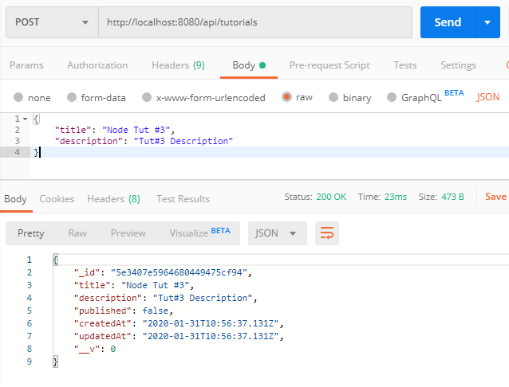

After creating some new Tutorials, you can check MongoDb collection:

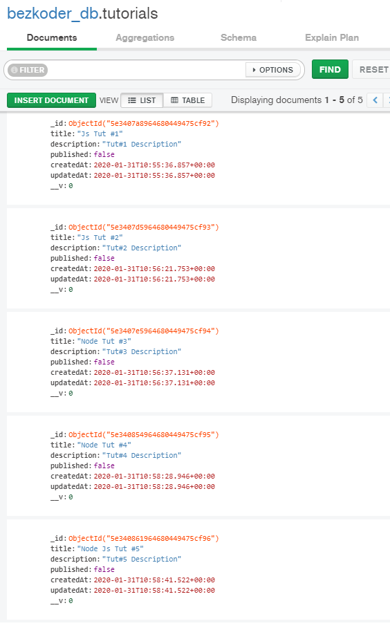

**-   Retrieve a single Tutorial by id using `GET /tutorials/:id` Api**

  
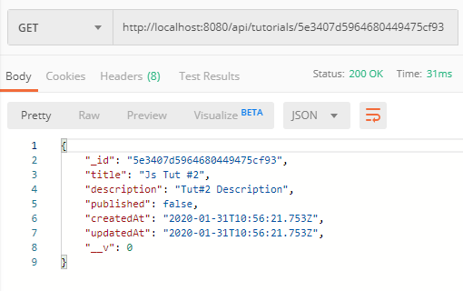

**-   Update a Tutorial using `PUT /tutorials/:id` Api**

  
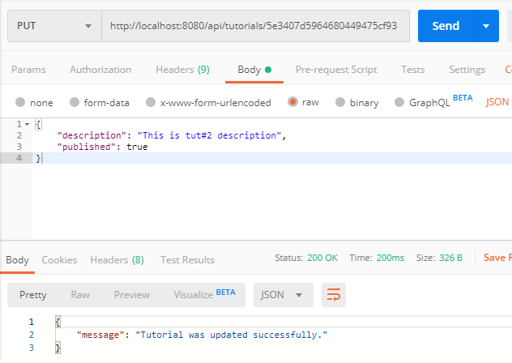

Check `tutorials` collection after some documents were updated:

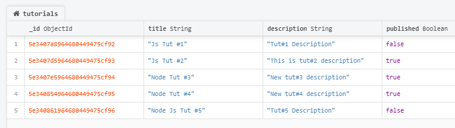

**-   Find all Tutorials which title contains ‘js’: `GET /tutorials?title=js`**

  
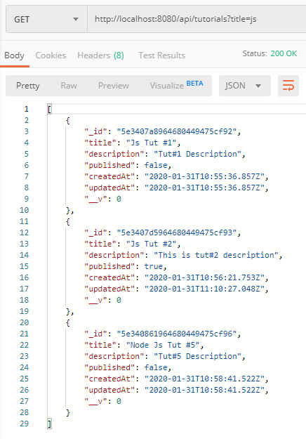

**-   Find all published Tutorials using `GET /tutorials/published` Api**

  
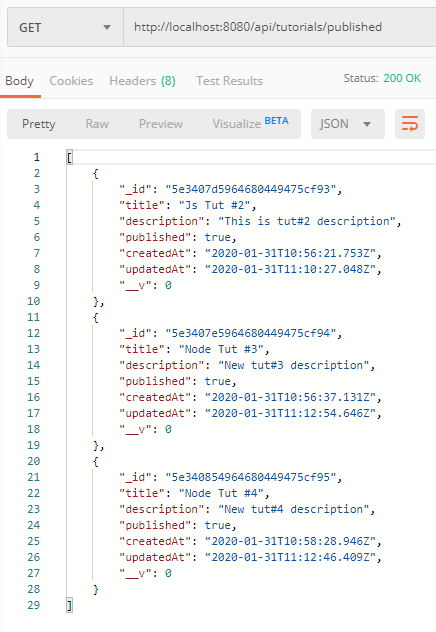

**-   Delete a Tutorial using `DELETE /tutorials/:id` Api**

  
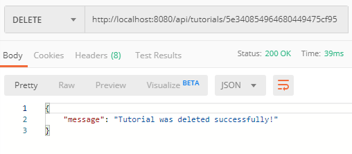

The Tutorial was removed from `tutorials` collection:

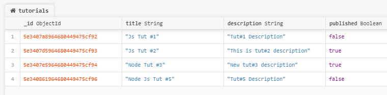

**-   Delete all Tutorials using `DELETE /tutorials` Api**

  
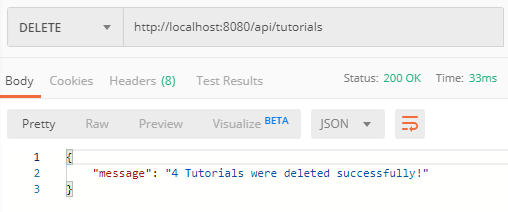
