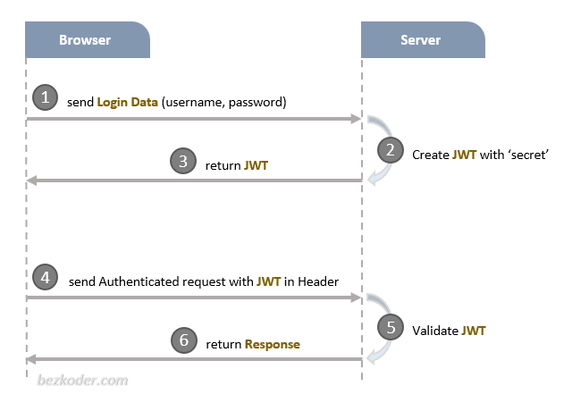
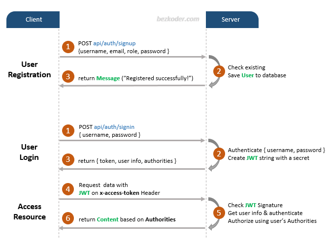
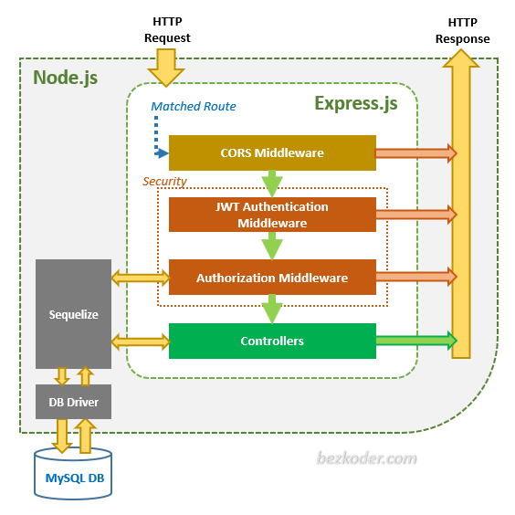
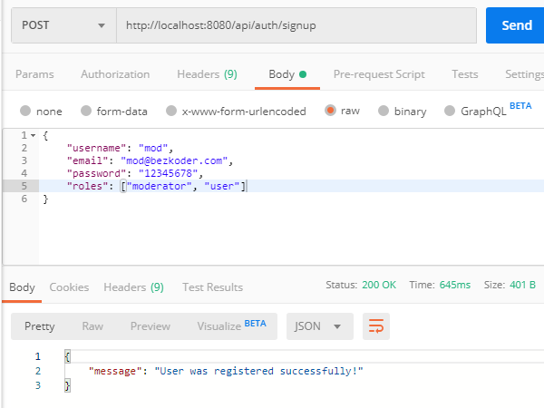
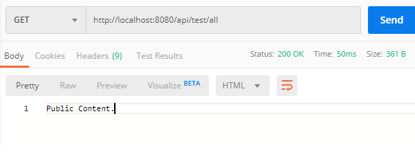
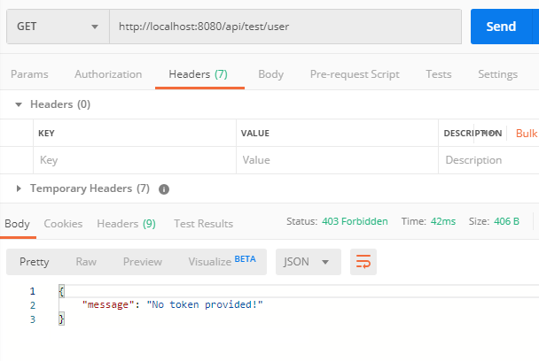
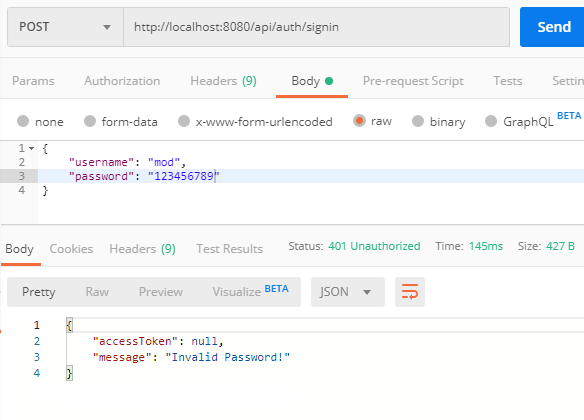
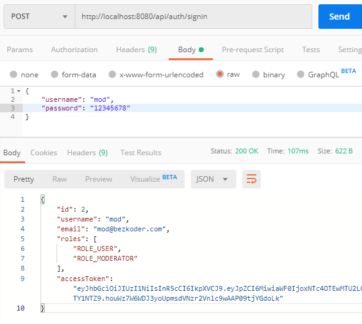
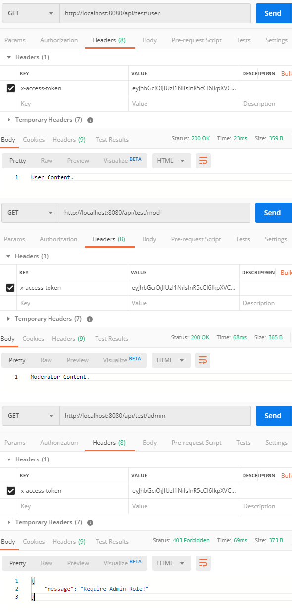

# Node.js – JWT Authentication & Authorization example with JSONWebToken & Sequelize

## Project setup
```
npm install
```

### Run
```
node server.js
```

In this tutorial, we’re gonna build a Node.js Express Rest API example that supports Token Based Authentication with JWT ([JSONWebToken](https://www.npmjs.com/package/jsonwebtoken)). You’ll know:

-   Appropriate Flow for User Signup & User Login with JWT Authentication
-   Node.js Express Architecture with CORS, Authentication & Authorization middlewares & Sequelize
-   How to configure Express routes to work with JWT
-   How to define Data Models and association for Authentication and Authorization
-   Way to use Sequelize to interact with MySQL Database

___
Comparing with Session-based Authentication that need to store Session on Cookie, the big advantage of Token-based Authentication is that we store the JSON Web Token (JWT) on Client side: Local Storage for Browser, Keychain for IOS and SharedPreferences for Android… So we don’t need to build another backend project that supports Native Apps or an additional Authentication module for Native App users.



There are three important parts of a JWT: Header, Payload, Signature. Together they are combined to a standard structure: `header.payload.signature`.

The Client typically attaches JWT in **Authorization** header with Bearer prefix:

```
Authorization: Bearer [header].[payload].[signature]
```

Or only in **x-access-token** header:

```
x-access-token: [header].[payload].[signature]
```

For more details, you can visit:  


## Overview of Node.js Express JWT Authentication example

We will build a Node.js Express application in that:

-   User can signup new account, or login with username & password.
-   By User’s role (admin, moderator, user), we authorize the User to access resources

These are APIs that we need to provide:

| Methods | Urls | Actions |
| --- | --- | --- |
| POST | /api/auth/signup | signup new account |
| POST | /api/auth/signin | login an account |
| GET | /api/test/all | retrieve public content |
| GET | /api/test/user | access User’s content |
| GET | /api/test/mod | access Moderator’s content |
| GET | /api/test/admin | access Admin’s content |

## Flow for Signup & Login with JWT Authentication

The diagram shows flow of User Registration, User Login and Authorization process.



A legal JWT must be added to HTTP **x-access-token** Header if Client accesses protected resources.


You can have an overview of our Node.js Express App with the diagram below:



Via _Express_ routes, **HTTP request** that matches a route will be checked by **CORS Middleware** before coming to **Security** layer.

**Security** layer includes:

-   JWT Authentication Middleware: verify SignUp, verify token
-   Authorization Middleware: check User’s roles with record in database

If these middlewares throw any error, a message will be sent as HTTP response.

**Controllers** interact with MySQL Database via _Sequelize_ and send **HTTP response** (token, user information, data based on roles…) to client.

## Technology

-   Express 
-   bcryptjs 
-   jsonwebtoken 
-   Sequelize 
-   MySQL

## Project Structure

This is directory structure for our Node.js Express application:


– **config**

-   configure MySQL database & Sequelize
-   configure Auth Key

– **routes**

-   _auth.routes.js_: POST signup & signin
-   _user.routes.js_: GET public & protected resources

– **middlewares**

-   _verifySignUp.js_: check duplicate Username or Email
-   _authJwt.js_: verify Token, check User roles in database

– **controllers**

-   _auth.controller.js_: handle signup & signin actions
-   _user.controller.js_: return public & protected content

– **models** for Sequelize Models

-   _user.model.js_
-   _role.model.js_

– _server.js_: import and initialize necessary modules and routes, listen for connections.

## Create Node.js App

First, we create a folder for our project:

```
$ mkdir node-js-jwt-auth
$ cd node-js-jwt-auth
```

Then we initialize the Node.js App with a _package.json_ file:

```
npm init

name: (node-js-jwt-auth) 
version: (1.0.0) 
description: Node.js Demo for JWT Authentication
entry point: (index.js) server.js
test command: 
git repository: 
keywords: node.js, express, jwt, authentication, mysql
author: 
license: (ISC)

Is this ok? (yes) yes
```

We need to install necessary modules: `express`, `cors`, `sequelize`, `mysql2`, `jsonwebtoken` and `bcryptjs`.  
Run the command:

```
npm install express sequelize mysql2 cors jsonwebtoken bcryptjs --save
```

The package.json file now looks like this:

```
{
  "name": "node-js-jwt-auth",
  "version": "1.0.0",
  "description": "Node.js Demo for JWT Authentication",
  "main": "server.js",
  "scripts": {
    "test": "echo \"Error: no test specified\" && exit 1"
  },
  "keywords": [
    "node.js",
    "jwt",
    "authentication",
    "express",
    "mysql"
  ],
  "author": "",
  "license": "ISC",
  "dependencies": {
    "bcryptjs": "^2.4.3",
    "cors": "^2.8.5",
    "express": "^4.18.2",
    "jsonwebtoken": "^9.0.0",
    "mysql2": "^2.3.3",
    "sequelize": "^6.32.1"
  }
}
```

## Setup Express web server

In the root folder, let’s create a new _server.js_ file:

```
const express = require("express");
const cors = require("cors");

const app = express();

var corsOptions = {
  origin: "http://localhost:8081"
};

app.use(cors(corsOptions));

// parse requests of content-type - application/json
app.use(express.json());

// parse requests of content-type - application/x-www-form-urlencoded
app.use(express.urlencoded({ extended: true }));

// simple route
app.get("/", (req, res) => {
  res.json({ message: "Welcome to my application." });
});

// set port, listen for requests
const PORT = process.env.PORT || 8080;
app.listen(PORT, () => {
  console.log(`Server is running on port ${PORT}.`);
});
```

Let me explain what we’ve just done:  
– import `express` and `cors` modules:

-   Express is for building the Rest apis
-   [cors](https://www.npmjs.com/package/cors) provides Express middleware to enable CORS

– create an Express app, then add request body parser and `cors` middlewares using `app.use()` method. Notice that we set origin: `http://localhost:8081`.  
– define a GET route which is simple for test.  
– listen on port 8080 for incoming requests.

Now let’s run the app with command: `node server.js`.  
Open your browser with url [http://localhost:8080/](http://localhost:8080/)

## Configure MySQL database & Sequelize

In the **app** folder, create **config** folder for configuration with _db.config.js_ file like this:

```
module.exports = {
  HOST: "localhost",
  USER: "root",
  PASSWORD: "123456",
  DB: "testdb",
  dialect: "mysql",
  pool: {
    max: 5,
    min: 0,
    acquire: 30000,
    idle: 10000
  }
};
```

First five parameters are for MySQL connection.  
`pool` is optional, it will be used for Sequelize connection pool configuration:

-   `max`: maximum number of connection in pool
-   `min`: minimum number of connection in pool
-   `idle`: maximum time, in milliseconds, that a connection can be idle before being released
-   `acquire`: maximum time, in milliseconds, that pool will try to get connection before throwing error

For more details, please visit [API Reference for the Sequelize constructor](https://sequelize.org/master/class/lib/sequelize.js~Sequelize.html#instance-constructor-constructor).

## Define the Sequelize Model

In _models_ folder, create `User` and `Role` data model as following code:

**models**/_user.model.js_

```
module.exports = (sequelize, Sequelize) => {
  const User = sequelize.define("users", {
    username: {
      type: Sequelize.STRING
    },
    email: {
      type: Sequelize.STRING
    },
    password: {
      type: Sequelize.STRING
    }
  });

  return User;
};
```

**models**/_role.model.js_

```
module.exports = (sequelize, Sequelize) => {
  const Role = sequelize.define("roles", {
    id: {
      type: Sequelize.INTEGER,
      primaryKey: true
    },
    name: {
      type: Sequelize.STRING
    }
  });

  return Role;
};
```

These Sequelize Models represents **users** & **roles** table in MySQL database.

After initializing Sequelize, we don’t need to write CRUD functions, Sequelize supports all of them:

-   create a new User: `[create](https://sequelize.org/master/class/lib/model.js~Model.html#static-method-create)(object)`
-   find a User by id: `[findByPk](https://sequelize.org/master/class/lib/model.js~Model.html#static-method-findByPk)(id)`
-   find a User by email: `[findOne](https://sequelize.org/master/class/lib/model.js~Model.html#static-method-findOne)({ where: { email: ... } })`
-   get all Users: `[findAll](https://sequelize.org/master/class/lib/model.js~Model.html#static-method-findAll)()`
-   find all Users by _username_: `findAll({ where: { username: ... } })`

These functions will be used in our Controllers and Middlewares.

## Initialize Sequelize

Now create **app**/**models**/_index.js_ with content like this:

```
const config = require("../config/db.config.js");

const Sequelize = require("sequelize");
const sequelize = new Sequelize(
  config.DB,
  config.USER,
  config.PASSWORD,
  {
    host: config.HOST,
    dialect: config.dialect,
    pool: {
      max: config.pool.max,
      min: config.pool.min,
      acquire: config.pool.acquire,
      idle: config.pool.idle
    }
  }
);

const db = {};

db.Sequelize = Sequelize;
db.sequelize = sequelize;

db.user = require("../models/user.model.js")(sequelize, Sequelize);
db.role = require("../models/role.model.js")(sequelize, Sequelize);

db.role.belongsToMany(db.user, {
  through: "user_roles"
});
db.user.belongsToMany(db.role, {
  through: "user_roles"
});

db.ROLES = ["user", "admin", "moderator"];

module.exports = db;
```

The association between _Users_ and _Roles_ is Many-to-Many relationship:  
– One User can have several Roles.  
– One Role can be taken on by many Users.

We use `User.belongsToMany(Role)` to indicate that the _user_ model can belong to many _Role_s and vice versa.

With `through`, we’re gonna have a new table **user\_roles** as connection between **users** and **roles** table via their primary key as foreign keys.


Don’t forget to call `sync()` method in _server.js_.

```
...
const app = express();
app.use(...);

const db = require("./app/models");
const Role = db.role;

db.sequelize.sync({force: true}).then(() => {
  console.log('Drop and Resync Db');
  initial();
});

...
function initial() {
  Role.create({
    id: 1,
    name: "user"
  });
 
  Role.create({
    id: 2,
    name: "moderator"
  });
 
  Role.create({
    id: 3,
    name: "admin"
  });
}
```

`initial()` function helps us to create 3 rows in database.  
In development, you may need to drop existing tables and re-sync database. So you can use `force: true` as code above.

For production, just insert these rows manually and use `sync()` without parameters to avoid dropping data:

```
...
const app = express();
app.use(...);

const db = require("./app/models");

db.sequelize.sync();
...
```


## Configure Auth Key

**jsonwebtoken** functions such as `verify()` or `sign()` use algorithm that needs a secret key (as String) to encode and decode token.

In the **app**/**config** folder, create _auth.config.js_ file with following code:

```
module.exports = {
  secret: "your-secret-key"
};
```

You can create your own `secret` String.

## Create Middleware functions

To verify a Signup action, we need 2 functions:  
– check if `username` or `email` is duplicate or not  
– check if `roles` in the request is existed or not

**middleware**/_verifySignUp.js_

```
const db = require("../models");
const ROLES = db.ROLES;
const User = db.user;

checkDuplicateUsernameOrEmail = (req, res, next) => {
  // Username
  User.findOne({
    where: {
      username: req.body.username
    }
  }).then(user => {
    if (user) {
      res.status(400).send({
        message: "Failed! Username is already in use!"
      });
      return;
    }

    // Email
    User.findOne({
      where: {
        email: req.body.email
      }
    }).then(user => {
      if (user) {
        res.status(400).send({
          message: "Failed! Email is already in use!"
        });
        return;
      }

      next();
    });
  });
};

checkRolesExisted = (req, res, next) => {
  if (req.body.roles) {
    for (let i = 0; i < req.body.roles.length; i++) {
      if (!ROLES.includes(req.body.roles[i])) {
        res.status(400).send({
          message: "Failed! Role does not exist = " + req.body.roles[i]
        });
        return;
      }
    }
  }
  
  next();
};

const verifySignUp = {
  checkDuplicateUsernameOrEmail: checkDuplicateUsernameOrEmail,
  checkRolesExisted: checkRolesExisted
};

module.exports = verifySignUp;
```

To process Authentication & Authorization, we have these functions:  
\- check if `token` is provided, legal or not. We get token from **x-access-token** of HTTP headers, then use **jsonwebtoken**'s `verify()` function.  
\- check if `roles` of the user contains required role or not.

**middleware**/_authJwt.js_

```
const jwt = require("jsonwebtoken");
const config = require("../config/auth.config.js");
const db = require("../models");
const User = db.user;

verifyToken = (req, res, next) => {
  let token = req.headers["x-access-token"];

  if (!token) {
    return res.status(403).send({
      message: "No token provided!"
    });
  }

  jwt.verify(token,
            config.secret,
            (err, decoded) => {
              if (err) {
                return res.status(401).send({
                  message: "Unauthorized!",
                });
              }
              req.userId = decoded.id;
              next();
            });
};

isAdmin = (req, res, next) => {
  User.findByPk(req.userId).then(user => {
    user.getRoles().then(roles => {
      for (let i = 0; i < roles.length; i++) {
        if (roles[i].name === "admin") {
          next();
          return;
        }
      }

      res.status(403).send({
        message: "Require Admin Role!"
      });
      return;
    });
  });
};

isModerator = (req, res, next) => {
  User.findByPk(req.userId).then(user => {
    user.getRoles().then(roles => {
      for (let i = 0; i < roles.length; i++) {
        if (roles[i].name === "moderator") {
          next();
          return;
        }
      }

      res.status(403).send({
        message: "Require Moderator Role!"
      });
    });
  });
};

isModeratorOrAdmin = (req, res, next) => {
  User.findByPk(req.userId).then(user => {
    user.getRoles().then(roles => {
      for (let i = 0; i < roles.length; i++) {
        if (roles[i].name === "moderator") {
          next();
          return;
        }

        if (roles[i].name === "admin") {
          next();
          return;
        }
      }

      res.status(403).send({
        message: "Require Moderator or Admin Role!"
      });
    });
  });
};

const authJwt = {
  verifyToken: verifyToken,
  isAdmin: isAdmin,
  isModerator: isModerator,
  isModeratorOrAdmin: isModeratorOrAdmin
};
module.exports = authJwt;
```

**middleware**/_index.js_

```
const authJwt = require("./authJwt");
const verifySignUp = require("./verifySignUp");

module.exports = {
  authJwt,
  verifySignUp
};
```

## Create Controllers

### Controller for Authentication

There are 2 main functions for Authentication:  
\- `signup`: create new User in database (role is **user** if not specifying role)  
\- `signin`:

-   find `username` of the request in database, if it exists
-   compare `password` with `password` in database using **bcrypt**, if it is correct
-   generate a token using **jsonwebtoken**
-   return user information & access Token

**controllers**/_auth.controller.js_

```
const db = require("../models");
const config = require("../config/auth.config");
const User = db.user;
const Role = db.role;

const Op = db.Sequelize.Op;

var jwt = require("jsonwebtoken");
var bcrypt = require("bcryptjs");

exports.signup = (req, res) => {
  // Save User to Database
  User.create({
    username: req.body.username,
    email: req.body.email,
    password: bcrypt.hashSync(req.body.password, 8)
  })
    .then(user => {
      if (req.body.roles) {
        Role.findAll({
          where: {
            name: {
              [Op.or]: req.body.roles
            }
          }
        }).then(roles => {
          user.setRoles(roles).then(() => {
            res.send({ message: "User was registered successfully!" });
          });
        });
      } else {
        // user role = 1
        user.setRoles([1]).then(() => {
          res.send({ message: "User was registered successfully!" });
        });
      }
    })
    .catch(err => {
      res.status(500).send({ message: err.message });
    });
};

exports.signin = (req, res) => {
  User.findOne({
    where: {
      username: req.body.username
    }
  })
    .then(user => {
      if (!user) {
        return res.status(404).send({ message: "User Not found." });
      }

      var passwordIsValid = bcrypt.compareSync(
        req.body.password,
        user.password
      );

      if (!passwordIsValid) {
        return res.status(401).send({
          accessToken: null,
          message: "Invalid Password!"
        });
      }

      const token = jwt.sign({ id: user.id },
                              config.secret,
                              {
                                algorithm: 'HS256',
                                allowInsecureKeySizes: true,
                                expiresIn: 86400, // 24 hours
                              });

      var authorities = [];
      user.getRoles().then(roles => {
        for (let i = 0; i < roles.length; i++) {
          authorities.push("ROLE_" + roles[i].name.toUpperCase());
        }
        res.status(200).send({
          id: user.id,
          username: user.username,
          email: user.email,
          roles: authorities,
          accessToken: token
        });
      });
    })
    .catch(err => {
      res.status(500).send({ message: err.message });
    });
};
```

### Controller for testing Authorization

There are 4 functions:  
– `/api/test/all` for public access  
– `/api/test/user` for loggedin users (role: **user**/**moderator**/**admin**)  
– `/api/test/mod` for users having **moderator** role  
– `/api/test/admin` for users having **admin** role

**controllers**/_user.controller.js_

```
exports.allAccess = (req, res) => {
  res.status(200).send("Public Content.");
};

exports.userBoard = (req, res) => {
  res.status(200).send("User Content.");
};

exports.adminBoard = (req, res) => {
  res.status(200).send("Admin Content.");
};

exports.moderatorBoard = (req, res) => {
  res.status(200).send("Moderator Content.");
};
```

Now, do you have any question? Would you like to know how we can combine middlewares with controller functions?  
Let's do it in the next section.

## Define Routes

When a client sends request for an endpoint using HTTP request (GET, POST, PUT, DELETE), we need to determine how the server will response by setting up the routes.

We can separate our routes into 2 part: for Authentication and for Authorization (accessing protected resources).

**Authentication:**

-   POST `/api/auth/signup`
-   POST `/api/auth/signin`

**routes**/_auth.routes.js_

```
const { verifySignUp } = require("../middleware");
const controller = require("../controllers/auth.controller");

module.exports = function(app) {
  app.use(function(req, res, next) {
    res.header(
      "Access-Control-Allow-Headers",
      "x-access-token, Origin, Content-Type, Accept"
    );
    next();
  });

  app.post(
    "/api/auth/signup",
    [
      verifySignUp.checkDuplicateUsernameOrEmail,
      verifySignUp.checkRolesExisted
    ],
    controller.signup
  );

  app.post("/api/auth/signin", controller.signin);
};
```

**Authorization:**

-   GET `/api/test/all`
-   GET `/api/test/user` for loggedin users (user/moderator/admin)
-   GET `/api/test/mod` for moderator
-   GET `/api/test/admin` for admin

**routes**/_user.routes.js_

```
const { authJwt } = require("../middleware");
const controller = require("../controllers/user.controller");

module.exports = function(app) {
  app.use(function(req, res, next) {
    res.header(
      "Access-Control-Allow-Headers",
      "x-access-token, Origin, Content-Type, Accept"
    );
    next();
  });

  app.get("/api/test/all", controller.allAccess);

  app.get(
    "/api/test/user",
    [authJwt.verifyToken],
    controller.userBoard
  );

  app.get(
    "/api/test/mod",
    [authJwt.verifyToken, authJwt.isModerator],
    controller.moderatorBoard
  );

  app.get(
    "/api/test/admin",
    [authJwt.verifyToken, authJwt.isAdmin],
    controller.adminBoard
  );
};
```

Don't forget to add these routes in _server.js_:

```
...
// routes
require('./app/routes/auth.routes')(app);
require('./app/routes/user.routes')(app);

// set port, listen for requests
...
```

## Run & Test with Results

Run Node.js application with command: `node server.js`

Tables that we define in _models_ package will be automatically generated in MySQL Database.  
If you check the database, you can see things like this:

```
mysql> describe users;
+-----------+--------------+------+-----+---------+----------------+
| Field     | Type         | Null | Key | Default | Extra          |
+-----------+--------------+------+-----+---------+----------------+
| id        | int(11)      | NO   | PRI | NULL    | auto_increment |
| username  | varchar(255) | YES  |     | NULL    |                |
| email     | varchar(255) | YES  |     | NULL    |                |
| password  | varchar(255) | YES  |     | NULL    |                |
| createdAt | datetime     | NO   |     | NULL    |                |
| updatedAt | datetime     | NO   |     | NULL    |                |
+-----------+--------------+------+-----+---------+----------------+


mysql> describe roles;
+-----------+--------------+------+-----+---------+-------+
| Field     | Type         | Null | Key | Default | Extra |
+-----------+--------------+------+-----+---------+-------+
| id        | int(11)      | NO   | PRI | NULL    |       |
| name      | varchar(255) | YES  |     | NULL    |       |
| createdAt | datetime     | NO   |     | NULL    |       |
| updatedAt | datetime     | NO   |     | NULL    |       |
+-----------+--------------+------+-----+---------+-------+


mysql> describe user_roles;
+-----------+----------+------+-----+---------+-------+
| Field     | Type     | Null | Key | Default | Extra |
+-----------+----------+------+-----+---------+-------+
| createdAt | datetime | NO   |     | NULL    |       |
| updatedAt | datetime | NO   |     | NULL    |       |
| roleId    | int(11)  | NO   | PRI | NULL    |       |
| userId    | int(11)  | NO   | PRI | NULL    |       |
+-----------+----------+------+-----+---------+-------+
```

If you don't use `initial()` function in Sequelize `sync()` method. You need to run following SQL script:

```
mysql> INSERT INTO roles VALUES (1, 'user', now(), now());
mysql> INSERT INTO roles VALUES (2, 'moderator', now(), now());
mysql> INSERT INTO roles VALUES (3, 'admin', now(), now());
```

3 records will be created in `roles` table:

```
mysql> select * from roles;
+----+-----------+---------------------+---------------------+
| id | name      | createdAt           | updatedAt           |
+----+-----------+---------------------+---------------------+
|  1 | user      | 2020-01-13 09:05:39 | 2020-01-13 09:05:39 |
|  2 | moderator | 2020-01-13 09:05:39 | 2020-01-13 09:05:39 |
|  3 | admin     | 2020-01-13 09:05:39 | 2020-01-13 09:05:39 |
+----+-----------+---------------------+---------------------+
```

Register some users with `/signup` API:

-   **admin** with `admin` role
-   **mod** with `moderator` and `user` roles
-   **zkoder** with `user` role



Our tables after signup could look like this.

```
mysql> select * from users;
+----+----------+--------------------+--------------------------------------------------------------+---------------------+---------------------+
| id | username | email              | password                                                     | createdAt           | updatedAt           |
+----+----------+--------------------+--------------------------------------------------------------+---------------------+---------------------+
|  1 | admin    | admin@bezkoder.com | $2a$08$w3cYCF.N0UQZO19z8CQSZ.whzxFS5vMoi9k51g3TQx9r5tkwrIXO2 | 2020-01-13 09:21:51 | 2020-01-13 09:21:51 |
|  2 | mod      | mod@bezkoder.com   | $2a$08$tTj1l28esAxPSSvl3YqKl./nz35vQF7Y76jGtzcYUhHtGy6d.1/ze | 2020-01-13 09:22:01 | 2020-01-13 09:22:01 |
|  3 | zkoder   | user@bezkoder.com  | $2a$08$U2F07dLyYZjzTxQbFMCAcOd1k8V1o9f6E4TGVJHpy0V6/DC7iS0CS | 2020-01-13 09:23:25 | 2020-01-13 09:23:25 |
+----+----------+--------------------+--------------------------------------------------------------+---------------------+---------------------+


mysql> select * from user_roles;
+---------------------+---------------------+--------+--------+
| createdAt           | updatedAt           | roleId | userId |
+---------------------+---------------------+--------+--------+
| 2020-01-13 09:22:01 | 2020-01-13 09:22:01 |      1 |      2 |
| 2020-01-13 09:23:25 | 2020-01-13 09:23:25 |      1 |      3 |
| 2020-01-13 09:22:01 | 2020-01-13 09:22:01 |      2 |      2 |
| 2020-01-13 09:21:51 | 2020-01-13 09:21:51 |      3 |      1 |
+---------------------+---------------------+--------+--------+
```

**Access public resource:** GET `/api/test/all`



**Access protected resource:** GET `/api/test/user`



**Login an account (with wrong password):** POST `/api/auth/signin`



**Login an account:** POST `/api/auth/signin`



**Access protected resources:** GET `/api/test/user`



## Conclusion

Congratulation!

Today we've learned so many interesting things about Node.js Token Based Authentication with JWT - JSONWebToken in just a Node.js Express Rest Api example.  
Despite we wrote a lot of code, I hope you will understand the overall architecture of the application, and apply it in your project at ease.

