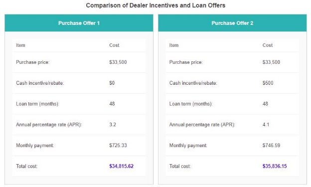

` `Add the necessary CSS rules to styles.css so the provided HTML produces the following webpage: 

**Hints( Refer only if required as last option):** 

The following style rules should be added to styles.css:

- The default fonts (in order of priority)  should be Roboto, Helvetica, and sans-serif 
- The heading "Comparison of Dealer Incentives and Loan Offers" should be 16px font using color #444444 and have centered text
- Define a container class whose contents is centered, has a 5 pixel margin, and defines  a font size of 13px 
- Each offer is defined in a 
 tag with the class offer. Define the offer class such that: 
- Each offer is displayed inline-block, with a fixed width of 400 pixels, a 4 pixel margin, and centered text
- Each offer has a 1 pixel solid border using color #cccccc
- The offer title is defined in a 
 tag with offerTitle class. Define the 

offerTitle class such that: 

- The title uses 14px bold font with color #ffffff
- The title's background is colored #00b3b3
- The title has no margin and 15 pixels of padding 
- The offer contents are defined in a 
 tag with class offerContents. Define the offerContents class such that: 
  - Each offer contents div has 20 pixels of padding and background colored #fafafa
- Define CSS rules such that all tables have the following styling: 
  - The table should have a width of 100%, background colored #ffffff, and no border spacing 
  - Header cells should use a 12px bold font with color #777777
  - Data cells should use a font lighter than normal weight with color #444444
  - Header cells should have 10 pixels of padding and no margin
  - Data cells should have 10 pixels of padding on the left and right, 20 pixels of padding on top and bottom, and no margin
  - Both header cells and data cells should left align text
  - Both header cells and data cells  should have a solid bottom border of 1 pixel using color #f1f1f1 
- Define a class  finalValue that defines a bold font weight with color #2222ff
