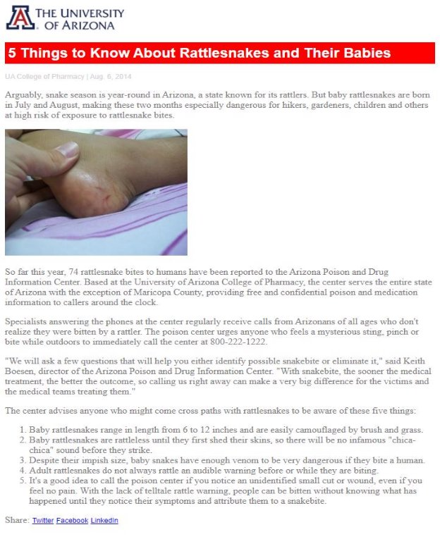

Add the necessary CSS rules to styles.css so the provided HTML produces the following webpage: 

**Hints( Refer only if required as last option):** 

Add CSS rules to styles.css that matches the following styling:

- Both article's images styled with a width of 300px
- Article's <h1> tag styled with: 
  - 5px padding all around 
  - Font family of Arial 
  - Font size of 24px 
  - Font color of white 
  - Background color of red 
- Selecting the id of author-name-and-date, style the author name and date with:
  - Font family of Arial 
  - Font size of 12px 
  - Font color of lightgray 
- Article's text (
 and <ol> tags) styled with: 
  - Font family of Times New Roman
  - Font size of 16px 
  - Font color of gray 
- Article's share links (<a> tags) styled with: 
  - Font family of Arial 
  - Font size of 12px 
  - Font color of blue 

Note: Colors, font  sizes, padding, etc. must be exact.
