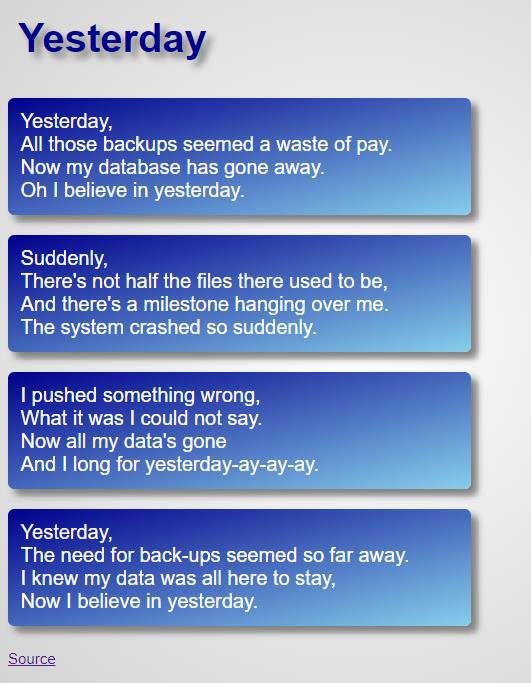

The HTML file contains a song based on the Beatles' Yesterday. Modify the CSS file to produce the following webpage: 

Requirements **Hints: ( Refer only if needed)** 

1. The body element should have:
- Arial font-family 
- A radial-gradient background that goes from white to light gray ("lightgray") 
2. The h1 element should have:
   1. Dark blue ("darkblue") font color 
   1. 8 pixel padding 
   1. Gray text-shadow with 5 pixel x and y offsets and a 6 pixel blur radius.
2. The p elements with lyrics should have:
- White font color 
- 350 pixel width 
- 16 pixel font-size 
- 10 pixel padding 
- A linear-gradient background that goes from dark blue ("darkblue") to sky blue ("skyblue") and runs from the top-left corner to the bottom-right corner 
- Gray box-shadow with 5 pixel x and y offsets and a 6 pixel blur radius 
- 5 pixel border-radius 
