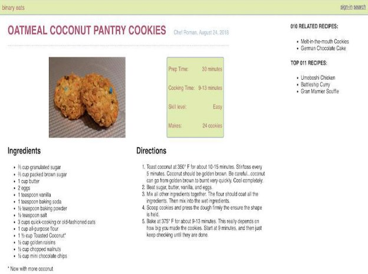

Modify styles.css so the HTML produces the webpage below.

**Hints: ( Refer only if needed)** 

Add the following style rules to the stylesheet:

- <header> tag: set display to be flex and justify-content to be space-between 
- content class: set display to be flex and flex-wrap to be wrap 
- main-content class: set display to be flex, flex-wrap to be wrap, flex-grow to be 1, and flex-basis to be 70% 
- title class: set display to be flex and align-items to be baseline
- summary class: set display to be flex, justify-content to be space-evenly, flex-grow to be 1, and flex-basis to be 100% 
- 
 tag child of 
 tag child of summary class: set display to be flex and justify- content to be space-between 
- ingredients and directions classes: set flex-grow to be 1 and flex-basis to be 45% 
- related-content class: set flex-grow to be 1 and flex-basis to be 20% 
