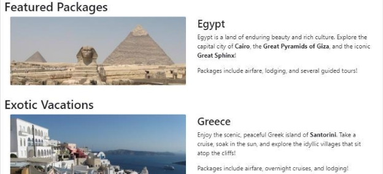
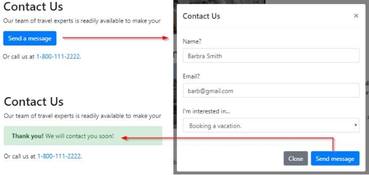

The provided Mediterranean Vacations webpage needs Bootstrap to make the webpage responsive. 

Download Bootstrap  

Add <link> and <script> tags to index.html so the webpage downloads the necessary Bootstrap-related files: 

1. https://cdn.jsdelivr.net/npm/bootstrap@5.1.3/dist/css/bootstrap.min.css integrity="sha384 - 1BmE4kWBq78iYhFldvKuhfTAU6auU8tT94WrHftjDbrCEXSU1oBoqyl2QvZ6jIW3" crossorigin="anonymous" 
1. https://cdn.jsdelivr.net/npm/bootstrap@5.1.3/dist/js/bootstrap.min.js integrity="sha384 - QJHtvGhmr9XOIpI6YVutG+2QOK9T+ZnN4kzFN1RtK3zEFEIsxhlmWl5/YESvpZ13" crossorigin="anonymous" 

Nav container  

Add the necessary Bootstrap classes to <nav> and the nav's child elements so the nav acts as a fluid container with one row. Each <li> should use the col-md class to form one equally - spaced row when the viewport is at least 768px wide.

Do not add or remove any HTML elements.

The screenshot below the navigation links on a single row when the viewport is at least 768px wide. 

Benefits container  

Add the necessary Bootstrap classes to the 
 with ID benefits and the div's child elements so the div acts as a responsive fixed-width container with a max-width setting. The inner divs should use the col-sm class to form one equally-spaced row when the viewport is at least 576px wide. 

Do not add or remove any HTML elements.

The screenshot below shows the three benefits on a single row when the vie wport is at least 576px wide. 

Section div containers  

Each <section> has a child 
 that has a fluid container with one row. Use the col-lg class to create two equally-spaced columns so the photo is on the left and the text description is on the right when the viewport is at least 992px wide.

Do not add or remove any HTML elements.

The screenshot below shows the vacation photos with descripti ons on the right when the viewport is at least 992px wide.

Responsive images  

Add the rounded class to the photos to give the photos rounded corners.

Add the img-fluid class to the photos so the photos stretch to fill the column when the viewport is at least 992px wide.

The screenshot below shows the rounded corners. The images grow in size as the viewport is made wider. 

Show an Alert  

A Bootstrap Modal with ID contact-modal is defined in the section with ID contact. Clicking the "Send a message" button displays the Modal, and clicking either of the Modal's buttons closes the Modal. 

Add an Alert with ID conf-alert immediately below the "Send a message" button. The Alert should use the following classes: alert, alert-success, and collapse. The Alert should read: "Thank you! We will contact you soon!"

The JavaScript code in script.js hides the "Send a message" button and shows the Alert when the Modal's "Send message" button is clicked. No JavaScript code modifications are required.

The screenshot below shows the Modal that is displayed when clicking the "Send a message" button. After the user types their information and click "Send message", the Modal disappears , and the Alert should appear in place of the "Send a message" button.

