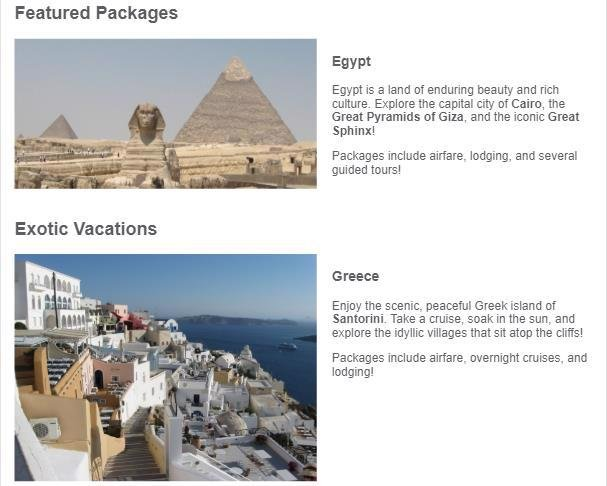

The provided Mediterranean Vacations webpage is designed for a mobile screen, as shown below. The navigation links near the top to Featured Packages, Exotic Vacations, and Historic Locations all link to sections within the webpage.

Add the necessary media queries to styles.css so the webpage scales appropriately to larger viewports. Do not modify the page's HTML.

600px breakpoint  

**Hints: (Refer only if required)** 

Add a media query that applies when the viewport's width is at least 600px. Use the .benefits-container selector to set flex-direction: row; 

The screenshot below shows how the benefits change from being displayed in one column to being displayed in one row when the viewport is at least 600px wide.

700px breakpoint  

**Hints: (Refer only if required)** 

Add a media query that applies when the viewport's width is at least 700px. Use the nav li selector to set display: inline; so the three navigation links now appear next to each other. Also use the header > h1 selector to make the h1 font size 3rem instead of 2rem.

The screenshot below shows how the "Mediterranean Vacations" font size increases and the navigation links appear on a single row when the viewport is at least 700px wide.

800px breakpoint  

**Hints: (Refer only if required)** 

Add a media query that applies when the viewport's width is at least 800px:

- Use the .vacation-container img selector to change the image width to 50vw so vacation images occupy half the viewport's width.
- Use the .vacation-container selector to make the vacation descriptions appear to the right of the vacation images instead of underneath.
- Use the .vacation-container > div selector to add a 20px margin between the vacation descriptions and images.

The screenshot below shows how the vacation image and text now appear next to each other when the viewport is at least 800px wide.

