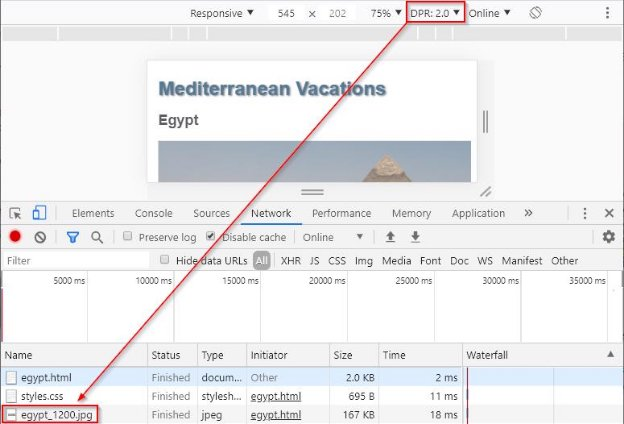

In this lab, you will add responsive images to the Egypt vacation webpage as shown below.

Different resolutions for different DPRs 

Modify the first  in egypt.html to use the srcset attribute. Show egypt\_600.jpg on a 1 DPR screen, egypt\_1200.jpg on a 2 DPR screen, and egypt\_1800.jpg on a 3 DPR screen.

The Chrome DevTools' Network tab can be used to verify that the appropriate image is requested depending on the DPR. Ex: The screenshot below shows egypt\_1200.jpg is requested when the DPR is 2.0. 

Different image sizes for different viewport widths 

Modify the second  in egypt.html to use the srcset and sizes attributes. **Hints: (Refer only if required)** 

The srcset attribute should indicate the image names and associated sizes:

- luxor\_600.jpg is 600 pixels wide 
- luxor\_800.jpg is 800 pixels wide 
- luxor\_1200.jpg is 1200 pixels wide

The sizes attribute should describe the image size requirements for various viewport widths:

- When the viewport width is at least 700px wide, the image width should be 600px.
- When the viewport width is at least 500px wide, the image width should be 400px.
- The default image width should be 200px.

Resizing the browser width should cause the three different images to display at the 500 and 700 breakpoints. 

Art direction for different viewport widths 

Add <picture> tags around the third  in egypt.html. Then add the appropriate tag inside <picture> so hotel\_wide.jpg is displayed instead of hotel\_narrow.jpg when the viewport width is at least 500px wide. 

Resizing the browser should display hotel\_narrow.jpg when the viewport width is < 500px wide and hotel\_wide.jpg otherwise.

SVG image for list background 

Modify styles.css so check.svg is displayed centered in the background of the unordered list. Set the following CSS properties:

**Hints: (Refer only if required)** 

- background-image should display check.svg
- background-repeat should be no-repeat 
- background-position should be center 
- background-size should be 60vw 

Resizing the browser width should cause the check.svg image to grow and shrink.
