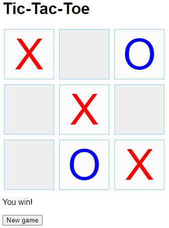

In this lab, you will write JavaScript to implement a Tic-Tac-Toe game, as shown below. The human is X, and the computer is O. A "New game" button starts a new game.

# Investigate the page elements
Download the ZIP file below containing HTML, CSS, and JavaScript files. The index.html file contains all needed page elements for a game of Tic-Tac-Toe:

- A div with ID gameBoard and 9 buttons forms the game board. CSS in tictactoe.css converts the div and buttons into a 3x3 grid.
- A paragraph with ID turnInfo, initially containing text "TURN INFO", indicates the turn is the player's or computer's.
- A "New game" button with ID newGameButton allows the player to clear the board and start a new game.
# Investigate the stylesheet
The tictactoe.css file declares .x and .o rules to set the X and O button colors. Other CSS rules style the grid and buttons.
# Investigate the JavaScript
The tictactoe.js script has six declarations:

- playerTurn: Boolean variable that is true when the turn belongs to the player and false when the turn belongs to the computer.
- computerMoveTimeout: ID of an active timeout for the computer's move, or 0 if no such timeout exists.
- gameStatus: Object that contains four possible game statuses. The checkForWinner() function returns the appropriate game status.
- domLoaded(): Function that is called when the DOM loads to start the game. Events for the "New game" button click and game board button clicks are registered. Then newGame() is called to start the game. The domLoaded() function is implemented for you and requires no alteration.
- getGameBoardButtons(): Function that returns an array of the 9 <button> elements from the game board. The first 3 elements are the top row, the next 3 the middle row, and the last 3 are the bottom row. The getGameBoard() function is implemented for you and requires no alteration.
- checkForWinner(): Function that returns a gameStatus value indicating if the human has won, if the computer has won, if a draw occurs, or if more moves are available.
# Implement newGame() (2 points)
Implement the newGame() function to do the following:

1. Use clearTimeout() to clear the computer's move timeout and then set computerMoveTimeout back to 0.
1. Loop through all game board buttons and set the inner HTML of each to an empty string. Also remove the class name and disabled attribute. The disabled attribute prevents the user from clicking the button, but all the buttons should be clickable when starting a new game.
1. Allow the player to take a turn by setting playerTurn to true.
1. Set the text of the turn information paragraph to "Your turn".
# Implement boardButtonClicked() (2 points)
Implement the boardButtonClicked() function to do the following:

- If playerTurn is true:
  - Set the button's inner HTML to "X".
  - Add the "x" class to the button.
  - Set the button's disabled attribute to true so the button cannot be clicked again.
  - Call switchTurn() so the computer can take a turn.
# Implement switchTurn() (3 points)
Implement the switchTurn() function to do the following:

- Call checkForWinner() to determine the game's status.
- If more moves are left, do the following:
  - If switching from the player's turn to the computer's turn, use setTimeout() to call makeComputerMove() after 1 second (1000 milliseconds). Assign the return value of setTimeout() to computerMoveTimeout. The timeout simulates the computer "thinking", and prevents the nearly-instant response to each player move that would occur from a direct call to makeComputerMove().
  - Toggle playerTurn's value from false to true or from true to false.
  - Set the turn information paragraph's text content to "Your turn" if playerTurn is true, or "Computer's turn" if playerTurn is false.
- In the case of a winner or a draw game, do the following:
  - Set playerTurn to false to prevent the user from being able to place an X after the game is over.
  - If the human has won, display the text "You win!" in the turn info paragraph.
  - If the computer has won, display the text "Computer wins!" in the turn info paragraph.
  - If the game is a draw, display the text "Draw game" in the turn info paragraph.
# Implement makeComputerMove() (3 points)
Implement the makeComputerMove() function to do the following:

1. Choose a random, available button, and set the button's inner HTML to "O".
1. Add the "o" class to the button.
1. Set the button's disabled attribute to true.
1. Call switchTurn() at the end of the function to switch back to the player's turn.

