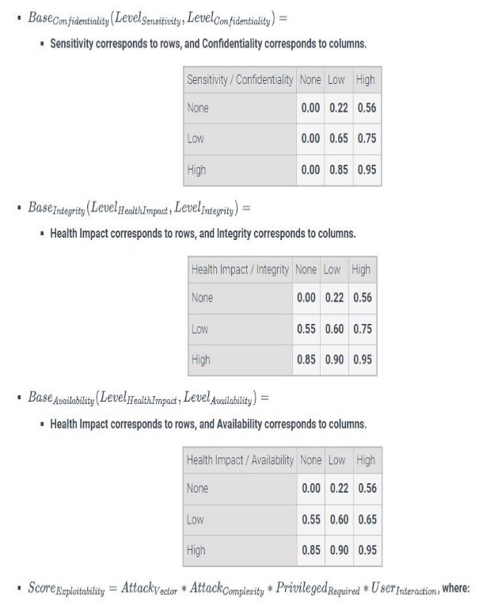
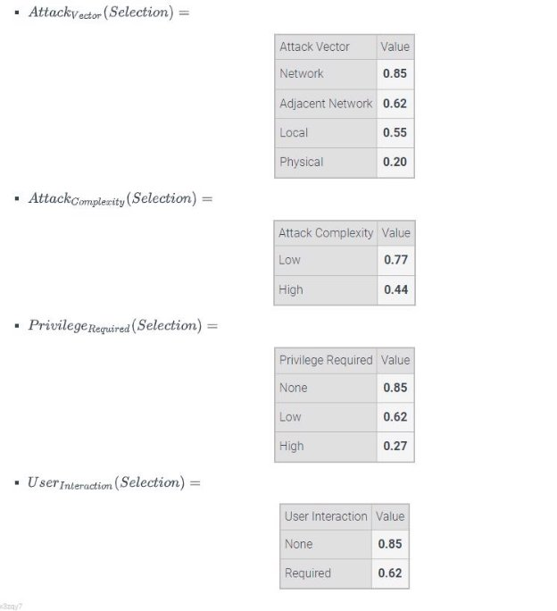

In this assignment, you will complete the implementation of a Medical Device Vulnerability Scoring webpage. The purpose of this webpage is to return a score that numerically quantifies how vulnerable a specific vulnerability is to a particular attack. The user can select system properties from a group of predetermined options, where each option is a styled radio button. Once options are selected for all possible properties, the webpage will display the vulnerability score (and hide the warning label).

1. Download the ZIP file below containing HTML, CSS, and JavaScript files.
1. Implement a function in calculator.js called updateScore() that verifies one button from each property is selected.
1. Using JavaScript, add a click or change event listener to each radio button. Do not add the event listener to the button label. Notice that the radio buttons are hidden using CSS. 
1. Once one button from each property is selected, the webpage should:
   1. Hide the warning label by setting the display style of the 
 with ID warning to none. Note: both none and hidden have similar visual effects, however none doesn't occupy any space, while hidden does occupy space, affecting the layout). 
   1. Compute the vulnerability score.
   1. The score should be updated and displayed inside the 
 with ID score. 
1. The score must have a minimum of 0 and a maximum of 10.
1. The final score must be **rounded up** to the tenths decimal place, and displayed with one decimal place. Ex: If the final score is 7.311456, the score should be displayed as 7.4.
1. Once the score is being displayed, updating a property will automatically update the vulnerability score. 
1. The score is computed as:

