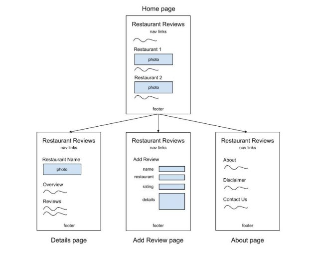
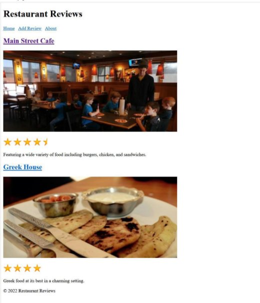
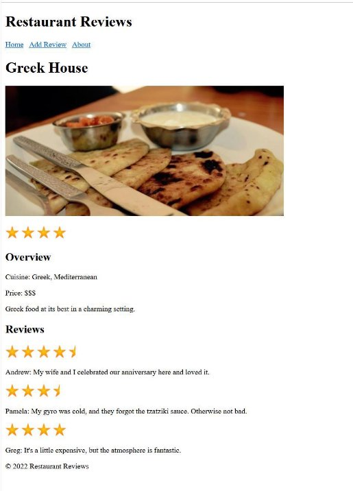
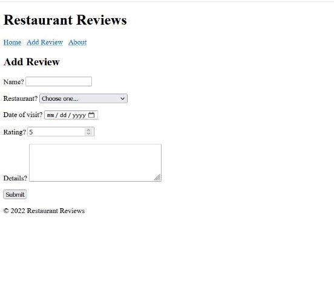
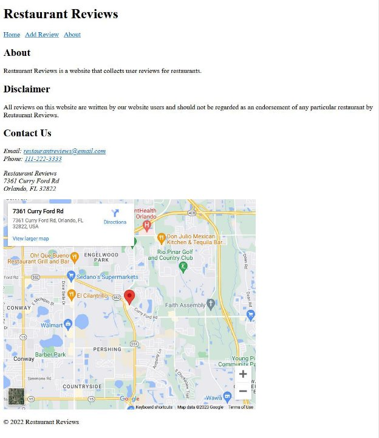

**Problem Statement:** We have to develop a RestaurentReviews Website according to below requirements 

This section presents an example restaurant review website. The website collects reviews from users and displays the reviews on each restaurant's details page.  

Website has 4 pages: 

1. Home Page 
1. Restaurant Details Page 
1. Add Review Page 
1. About Page 

**Wireframes of restaurant review webpages.** 

**Home page** 

The home page for Restaurant Reviews is index.html, which is a common filename for a website's home page. Most web servers by default serve the index.html file when a URL does not specify an explicit filename. Ex: Accessing http:/pesto.tech/ in a web browser loads http://pesto.tech/index.html. 

To maintain a consistent look, all the website's pages have the same \<header> tags with navigation links and \<footer> tags that specify the copyright information. The home page is broken into several sections with \<section> tags, and each of the featured restaurants are asssigned to a section. Home Page:

**Detail pages** 

The website provides detailed restaurant reviews when the user clicks the restaurant name on the home page. Only two restaurants are listed, so only two detail webpages are required for this example: 

1. mainstreetcafe.html - Details about Main Street Cafe 

2. greekhouse.html - Details about Greek House 
2. 

**Note: Dynamically-built webpages** 

As individuals enter new reviews, the static detail webpages need to be updated continually. Usually a website that displays frequently-changing content uses a server-side program to dynamically create webpages from data stored in a database. This example, however, uses static content for simplicity and hands-on 

**Add Review Page:** 

**About Page:** 

