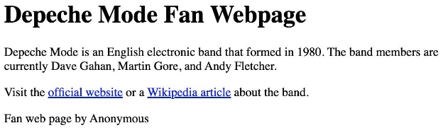

Create a webpage in a file called index.html about one of your favorite musicians, similar to the example below. 

Use the following HTML containers: 

- <header> with <h1> tags that contain the musician's name 
- <main> with 2 paragraphs: 
- 1st paragraph gives some background information 
- 2nd paragraph links to at least one website about the musician 
- <footer> that names the webpage's creator 
